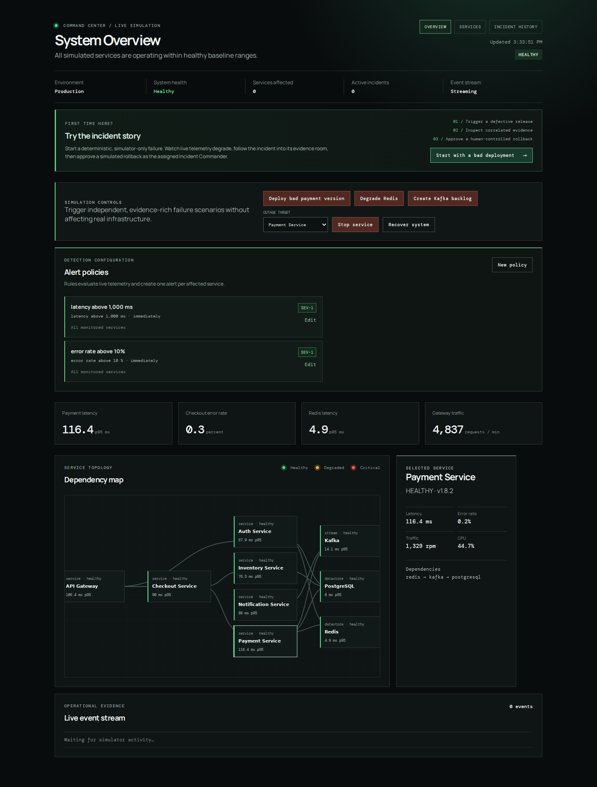
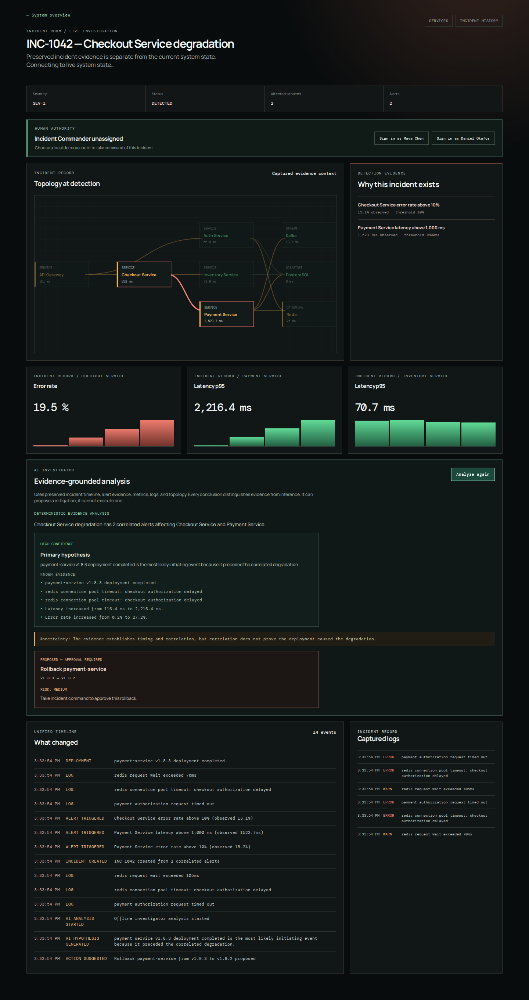

# AI Incident Commander

AI Incident Commander is a dark-mode incident-management and observability workspace for a simulated distributed system. It tells one complete operational story: a release fails, telemetry degrades, alerts correlate into an incident, an engineer investigates preserved evidence, an AI investigator proposes a safe mitigation, and a human Incident Commander approves the simulated rollback.

It is deliberately a modular monolith. The distributed system is simulated; the application itself stays small, local, and easy to run.



## What to try

1. Start the application and open the Command Center.
2. Select **Start with a bad deployment**. This affects only the deterministic simulator.
3. Watch payment latency, Redis latency, and checkout errors degrade. Alerts correlate into an incident.
4. Open the Incident Room, inspect the captured topology, metrics, logs, and timeline, then select **Analyze incident**.
5. Sign in locally as Maya Chen or Daniel Okafor and take incident command.
6. Approve the proposed rollback. The simulator recovers; after monitoring, resolve the incident and review it in Incident History.



## Why this project exists

The project demonstrates product engineering beyond a dashboard:

- deterministic failure simulation with real state transitions;
- policy-driven alerting and topology/time-based incident correlation;
- live updates through Server-Sent Events;
- incident-scoped evidence that remains available after recovery;
- evidence-grounded AI analysis with a deterministic offline fallback;
- explicit human approval, per-incident command, and an audit timeline;
- business-facing acceptance tests that run through both API and browser adapters.

## Architecture

```text
Browser (static HTML / CSS / JavaScript)
       │ initial reads + Server-Sent Events
       ▼
Node API / application layer
       ├── deterministic simulator ──► metrics, logs, deployments, topology
       ├── alert policies + correlation ──► alerts and incident lifecycle
       ├── incident evidence record ──► bounded historical investigation data
       ├── investigator port ──► deterministic analysis / optional Gemini
       └── command + approval rules ──► simulated rollback only after approval
```

The app uses in-memory state intentionally for a fast local feedback loop. PostgreSQL is the planned persistence target once the interaction model is settled. See [architecture details](docs/architecture.md) and the short [ADRs](docs/adr/).

## Incident model

Incidents are not just alert records. An incident owns its lifecycle, timeline, alerts, suggested actions, commander, and bounded evidence record:

```text
DETECTED → INVESTIGATING → MITIGATING → MONITORING → RESOLVED
```

Recovery does not erase evidence or auto-resolve an incident. Sustained healthy telemetry moves it to monitoring; the assigned Incident Commander explicitly resolves it.

## AI safety model

The investigator receives structured incident evidence—deployments, alerts, logs, metric history, and topology—not simulator controls. Its output separates known evidence, inference, and uncertainty. Citations and recommended actions are validated locally. It may propose a rollback, but only the assigned human Incident Commander can approve it; the decision and execution appear in the incident timeline.

By default, analysis is deterministic and works without credentials. Gemini is an optional adapter, not a runtime dependency for the demo.

## Run locally

Prerequisite: Node.js 24 or later.

```bash
npm install
npm run dev
```

Open the local address printed by the server. State is intentionally reset when the server restarts.

### Optional Gemini analysis

Create an API key in Google AI Studio and keep it outside the repository. Then:

```bash
AI_INCIDENT_COMMANDER_AI_PROVIDER=gemini \
GEMINI_API_KEY=your_key \
GEMINI_MODEL=gemini-2.5-flash-lite \
npm run dev
```

If Gemini is unavailable or produces invalid evidence references, the product falls back to deterministic offline analysis.

## Test strategy

```bash
npm test
npm run check   # strict TypeScript type check (tsc, no emit)
```

GitHub Actions runs those same checks on every pull request to `main` and every
push to `main`, including Chromium-backed browser coverage. A failed browser
journey retains its screenshot as a short-lived workflow artifact.

- Unit and integration tests cover domain transitions, simulator behavior, correlation, transport safety, and investigator validation.
- Gherkin acceptance tests describe business behavior and run against a fast API adapter.
- The flagship scenario runs again through Playwright, using visible browser controls and live UI assertions. Failures retain a screenshot under `/tmp`.

The team follows test-first development. The project rules are in [AGENTS.md](AGENTS.md).

## Current boundaries

This portfolio version intentionally does **not** integrate with real cloud infrastructure, PagerDuty, Datadog, Slack, Kubernetes, or production rollback commands. The simulator makes the full incident story demonstrable without those dependencies. See the [roadmap decisions](docs/roadmap.md) for agreed sequencing.
